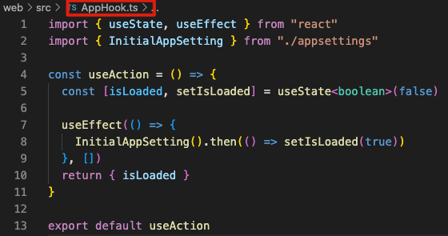
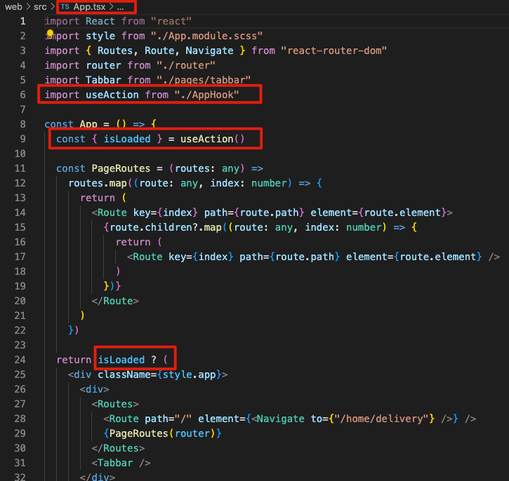

1. **在 public 中配置 appsetting.json**

```json
{
  "serverUrl": "https://xxxxx",
  "jsVersion": "3.8.0",
  "sourceSystem": "web_customer",
  "languagecode": "zh-TW"
}
```

2. **根目录下添加.env 文件**

```
PORT = 8080
```

3. **在 src 目录下添加 appsettings.ts 文件**

```ts
export interface AppSettings {
  serverUrl: string;
  jsVersion: string;
  sourceSystem: string;
  languagecode: string;
}

const settings = (window as any).appSettings;

export async function InitialAppSetting() {
  if ((window as any).appSettings) return (window as any).appSettings;

  await fetch("../appsetting.json", {
    headers: { "Content-Type": "application/json", Accept: "application/json" },
  })
    .then((res) => res.json())
    .then((res: AppSettings) => {
      return ((window as any).appSettings = res);
    });
}

export default settings as AppSettings;
```

4. **将 appsetting.ts 文件引入 AppHook.ts 和 App.tsx 中初始化 appsetting**

   

   

5. **在 src 目录下添加 api 文件，文件中添加 http-client.tsx 文件，封装 get 和 post 请求**

```tsx
import { AppSettings } from "../appsettings";

export async function Get<T>(url: string) {
  return base<T>(url, "get");
}

export async function Post<T>(url: string, data?: object) {
  return base<T>(url, "post", data);
}

export async function base<T>(
  url: string,
  method: "get" | "post",
  data?: object
) {
  const settings: AppSettings = (window as any).appSettings;

  return await fetch(`${settings.serverUrl}${url}`, {
    method: method,
    body: data ? JSON.stringify(data) : undefined,
    headers: {
      js_version: settings.jsVersion,
      source_system: settings.sourceSystem,
      "Content-Type": "application/json",
    },
  })
    .then((res) => res.json())
    .then((res: T) => {
      return res;
    })
    .catch((err) => {
      console.log("request error:", err);
      throw new Error(err);
    });
}
```

6. **src 目录下新建文件夹统一管理接口地址，将封装好的 get 和 post 请求引入**

   

7. **具体组件调用接口示例**

```ts
PostSwiperList({
  pageLocation: PageLocation.HomePageUp,
  languageCode: settings.languagecode,
  latLng: latlng,
}).then((data) => {
  setSwiperList(data);
});
```
