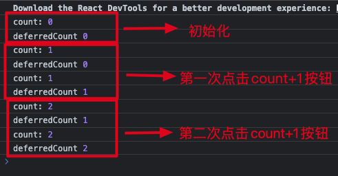

### useDeferredValue 是 react18 引入的一个用于性能优化的 hooks，可以用于延迟获取某个值，并且在延迟获取之间将会返回旧值

### 举个例子：

```
import { Button } from "antd";
import { useDeferredValue, useState } from "react";

export const Test = () => {
  const [count, setCount] = useState<number>(0);

  const deferredCount = useDeferredValue(count);

  console.log("count:", count);

  console.log("deferredCount", deferredCount);

  return (
    <div>
      <Button type="primary" onClick={() => setCount(count + 1)}>
        count+1
      </Button>
    </div>
  );
};

```

#### 可以看出来，点击 count+1 按钮时渲染了两次：在第一次渲染的时候，count 是实时更新了，但是 deferredCount 还是返回了 count 的旧值 0，然后再次渲染，count 值不变依旧是 0，这个时候 deferredCount 才渲染为了新值 1



### 使用场景如下：

#### 实现输入框内容实时更新到列表功能

```

import { Input } from "antd";
import { memo, useDeferredValue, useState } from "react";

const List = memo((props: { inputValue: string }) => {
  const { inputValue } = props;

  console.log("List render");

  let k = 0;

  for (let i = 0; i <= 400000000; i += 1) {
    k = i;
  }

  return (
    <ul>
      <li>
        Cycle Times {k}Text:{inputValue}
      </li>
      <li>
        Cycle Times {k}Text:{inputValue}
      </li>
      <li>
        Cycle Times {k}Text:{inputValue}
      </li>
      <li>
        Cycle Times {k}Text:{inputValue}
      </li>
      <li>
        Cycle Times {k}Text:{inputValue}
      </li>
    </ul>
  );
});

export const Test = () => {
  const [inputValue, setInputValue] = useState<string>("");

  const deferredValue = useDeferredValue(inputValue);

  return (
    <div>
      <Input
        type="text"
        value={inputValue}
        onChange={(e) => {
          console.log("handleChange");

          setInputValue(e.target.value);
        }}
      />
      <List inputValue={deferredValue} />
    </div>
  );
};

```

#### 结果：useDeferredValue 不会立刻返回新的结果，会等到上一次返回的新结果处理完才会继续返回，而在 useDeferredValue 两次返回新结果之间也不会影响父组件也就是 Test 组件的渲染，这样就避免了输入框内容不能快速展现的问题，也避免了多次重复渲染 List 组件产生的额外消耗。

### useDeferredValue 与防抖节流对比：

#### 虽然这些技术在某些情况下是有用的，但 useDeferredValue 更适合优化渲染，因为它与 React 自身深度集成，并且能够适应用户的设备。与防抖或节流不同，useDeferredValue 不需要选择任何固定延迟时间。如果用户的设备很快（比如性能强劲的笔记本电脑），延迟的重渲染几乎会立即发生并且不会被察觉。如果用户的设备较慢，那么列表会相应地“滞后”于输入，滞后的程度与设备的速度有关。此外，与防抖或节流不同，useDeferredValue 执行的延迟重新渲染默认是可中断的。这意味着，如果 React 正在重新渲染一个大型列表，但用户进行了另一次键盘输入，React 会放弃该重新渲染，先处理键盘输入，然后再次开始在后台渲染。相比之下，防抖和节流仍会产生不顺畅的体验，因为它们是阻碍的：它们仅仅是将渲染阻塞键盘输入的时刻推迟了。如果你要优化的工作不是在渲染期间发生的，那么防抖和节流仍然非常有用。例如，它们可以让你减少网络请求的次数。你也可以同时使用这些技术。
