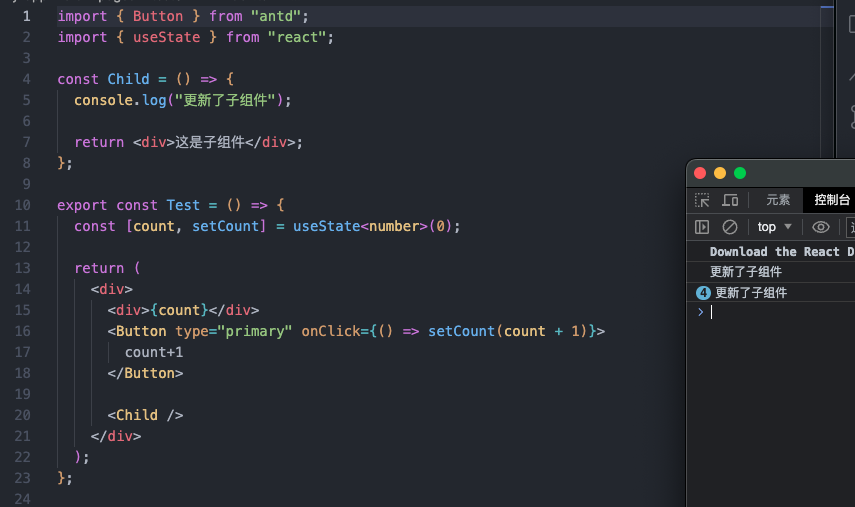

# React.memo、useMemo、useCallback

## React.memo:避免不必要的组件重新渲染，从而提高应用程序的性能

#### 这里点击按钮只改变 count，不涉及到子组件，可是子组件也重新渲染了好多次，有点浪费性能了



### 解决方法：使用 React.memo，将子组件包裹起来

```
// 基础使用，函数组件直接包裹React.memo默认使用浅层比较
const Child = React.memo(() => {
  console.log("更新了子组件");

  return <div>这是子组件</div>;
});

// 高阶使用，更加精确控制何时渲染组件，传递第二个参数给React.memo来指定自定义的比较函数。比较函数接收两个参数，分别是前一次的props和当前的props，返回一个布尔值表示是否需要重新渲染组件
import React from 'react';

const areEqual = (prevProps, nextProps) => {
  // 自定义比较逻辑
  // 返回 true 表示两个 props 相等，不需要重新渲染
  // 返回 false 表示两个 props 不相等，需要重新渲染
  return prevProps.value === nextProps.value;
};

const MyComponent = React.memo((props) => {
  console.log('Rendering MyComponent');
  return <div>{props.value}</div>;
}, areEqual);

```

### useMemo 接收一个箭头函数包裹的回调函数和依赖项数组，然后返回回调函数的计算结果

### 使用 useMemo：用于在组件渲染中进行记忆化计算，以避免不必要的重复计算，提高应用的性能。使用场景：

- 计算昂贵的结果：涉及到需要执行昂贵的计算或处理大量数据的情况下，使用 useMemo 将计算结果缓存起来；
- 避免不必要的渲染：某个组件的渲染结果仅依赖于特定的输入参数，并且这些参数没有发生变化时，可以使用 useMemo 缓存该组件的输出，避免不必要的重新渲染
