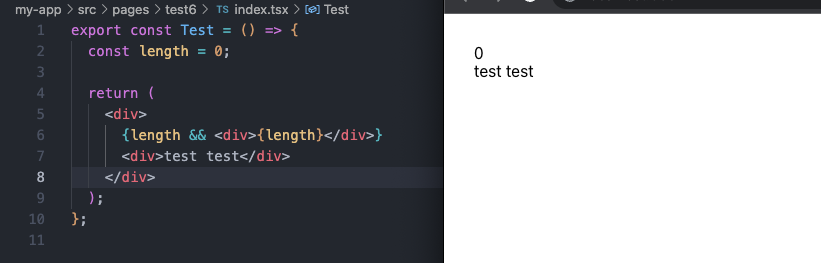

# 特定情况下尽量不使用&&

### 在 react 中通常使用&&来进行判断，如果条件成立就渲染&&后面的 dom 元素

### 如果使用 0 来判断的话会出现异常



### 虽然&&运算符会保留所有非布尔值并原样返回

```
  "" && 1 // ''
  0 && 1 // 0
  NaN && 1 // NaN

```

### 解决方案

```
  // 1、使用!!来将0转换成布尔类型
  {!!length && <div>{length}</div>}

  // 2、修改判断条件
  {length > 0 && <div>{length}</div>}

  // 3、使用三元表达式
  {length ? <div>{length}</div> : null}

  // 4、Boolean类型转换
  {Boolean(length) && <div>{length}</div>}
```
